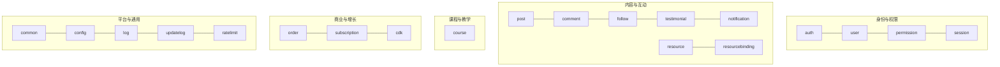
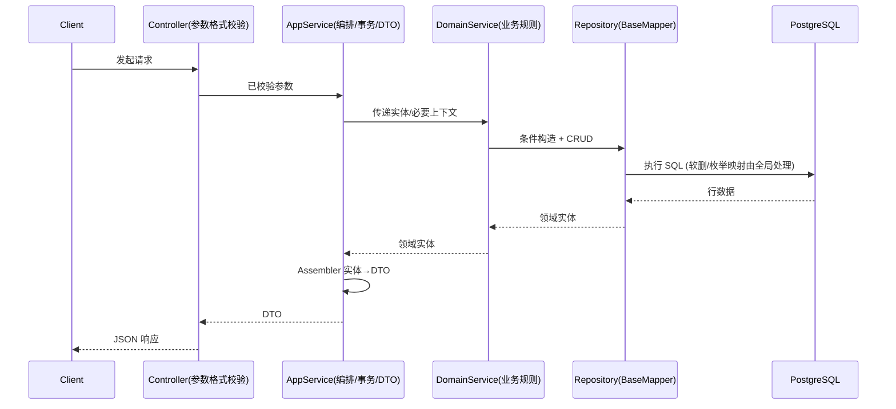

# 敲鸭社区（qiaoya-community）后端架构总览

> 面向了解项目的开发者/合作方/贡献者，用于快速认知“我们是什么、如何工作、如何部署与运维”。

## 一图总览（分层架构）
```mermaid
flowchart TB
  Client[(Web / App / 管理后台)] --> Controller[接口层 Controller (预留)]
  Controller --> AppService[应用层 AppService + DTO + Assembler]
  AppService --> DomainService[领域层 DomainService + Entity]
  DomainService --> Repository[Repository (BaseMapper)]
  Repository --> DB[(PostgreSQL)]

  subgraph Infrastructure[Infrastructure 横切能力]
    MP[MyBatis Plus\n(条件构造/分页/软删全局)]
    Flyway[Flyway 数据库迁移]
    TypeHandler[TypeHandler / Enum 映射]
    Crypto[Spring Security Crypto]
    Observability[Actuator / Metrics]
  end

  Infrastructure --- Controller
  Infrastructure --- AppService
  Infrastructure --- DomainService
  Infrastructure --- Repository
```

- 分层职责与调用约束：
  - Application → Domain Service → Repository 的单向调用；Assembler 位于应用层，使用静态方法
  - 参数“格式校验”在接口层，领域层只做“业务规则校验”（如唯一性、状态机）
  - Repository 仅继承 BaseMapper，不写自定义 SQL，使用条件构造器
  - 全局软删除与枚举类型映射由基础设施配置统一处理

## 领域地图（Domain Map）


- 代码路径：`src/main/java/org/xhy/community/domain/*`
- 权限复用：通过 `AccessLevel`（USER/ADMIN）在领域服务内控制隔离条件，避免重复接口

## 运行时交互（核心用例）


## 技术栈
- 核心：JDK 17、Spring Boot 3.2.0、MyBatis Plus 3.5.4、PostgreSQL、Flyway、Maven
- 安全与加密：Spring Security Crypto
- 规范与约束：
  - UUID（ASSIGN_UUID）字符串主键；DTO/服务层一律 String 类型
  - Assembler 静态方法，`BeanUtils.copyProperties`
  - 分页请求继承 `interfaces/common/request/PageRequest.java`
  - UserContext 仅限 Controller 使用
  - 管理员接口路由 `/api/admin/**`，应用服务命名 `AdminXxxAppService`

## 部署拓扑（单体后端，支持水平扩展）
```mermaid
flowchart LR
  Internet((Internet)) --> GW[Nginx / Ingress]
  GW --> APP1[Spring Boot 实例 A]
  GW --> APP2[Spring Boot 实例 B]
  APP1 & APP2 --> PG[(PostgreSQL)]
  APP1 & APP2 -. 可选 .-> Cache[(Redis/本地缓存)]
  APP1 & APP2 -. 可选 .-> MQ[(消息队列)]
  subgraph Observability[可观测性]
    Prom[Prometheus]
    Graf[Grafana]
    Logs[日志聚合(ELK/EFK)]
  end
  APP1 & APP2 -. 指标/日志 .-> Prom
  Prom --> Graf
  APP1 & APP2 -. 日志 .-> Logs
```

- 交付形态：
  - 开发：本机 JDK + Maven，Docker 可选
  - 线上：Docker 单机/多机；或纳管至 K8s（Ingress / HPA / Sidecar 观测）
- 数据库：托管 PostgreSQL 或自建主从/HA；Flyway 管理版本变更

## 运维能力（CI/CD 与发布可靠性）
- CI/CD：GitHub Actions + SSH + Docker（见 `docs/deployment/后端CI-CD技术方案-GitHub-Actions-SSH-Docker.md`）
- 冒烟测试：容器级健康/公开接口检查阻断部署（见 `docs/deployment/CI-容器级冒烟测试-复用步骤与示例.md`）
- 发布策略：蓝绿/金丝雀/候选容器预检（见 `docs/deployment/发布可靠性与回滚策略-蓝绿-金丝雀-候选容器预检.md`）
- 反向代理切流：Nginx / Traefik 蓝绿切换（见 `docs/deployment/Nginx-Traefik-蓝绿切流-运维操作手册.md`）
- 构建提速：国内仓库镜像 + 自托管 Runner（见 `docs/deployment/CI构建提速方案-国内仓库与自托管Runner.md`）

## 为什么值得关注（价值主张）
- 以 DDD 为中心的工程化分层：清晰边界、强复用、强扩展
- 极简数据访问：只用 BaseMapper 与条件构造，减少自定义 SQL 负担
- 一致的业务校验口径：格式校验前置到接口层，领域专注规则
- 生产可用的运维基建：CI/CD、冒烟、蓝绿/金丝雀、回滚策略与观测链路齐备
- 权限复用模型：`AccessLevel` 枚举统一约束用户/管理员查询范围

## 代码路径对照表（速查）
- 应用层：`src/main/java/org/xhy/community/application/{subdomain}/`（`service/*AppService`、`dto/*DTO`、`assembler/*Assembler`）
- 领域层：`src/main/java/org/xhy/community/domain/{subdomain}/`（`service/*DomainService`、`entity/*Entity`、`repository/*Repository`）
- 基础设施：`src/main/java/org/xhy/community/infrastructure/*`（`config/*`、`exception/*`、TypeHandler/枚举/MetaObjectHandler）
- 迁移脚本：`src/main/resources/db/migration`（PostgreSQL 语法）

---
如需对外展示（博客/README/官网），可直接复用本页的 Mermaid 图示与分层要点。
