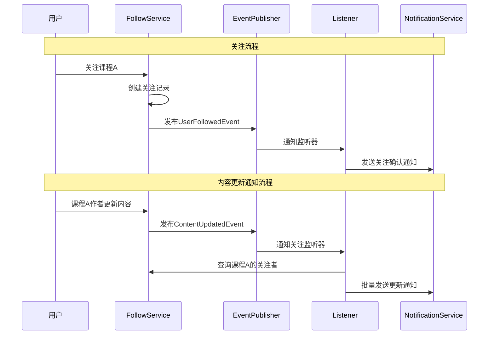

# 乔雅社区关注（Follow）功能设计文档

作者：后端
最后更新：2025-09-27
状态：设计稿（可落地）
适用范围：关注（Follow）模型、事件与接口（非付费订阅）

> 术语澄清：本篇文档中的“订阅”专指关注（Follow）功能，不涉及付费订阅套餐（Subscription Plan）。为避免混淆，下文可等价理解为“关注/Follow”。

## 1. 功能概述

### 1.1 业务背景
为乔雅社区增加订阅/关注功能，提高用户粘性和社区活跃度。用户可以关注其他用户、课程、章节、文章等内容，并在被关注对象发生变化时收到通知。

### 1.2 核心功能
- **多类型订阅**: 支持关注用户、课程、章节、文章
- **智能通知**: 基于事件驱动的实时通知机制
- **订阅管理**: 用户可管理自己的订阅列表
- **统计分析**: 为管理员提供订阅数据分析

## 2. 架构设计

### 2.1 领域模型

#### 2.1.1 核心实体设计
```java
@TableName("follows")
public class FollowEntity extends BaseEntity {
    /** 关注者用户ID */
    private String followerId;
    
    /** 被关注目标的ID (用户ID/课程ID/章节ID/文章ID) */
    private String targetId;
    
    /** 关注目标类型 */
    @TableField(typeHandler = FollowTargetTypeConverter.class)
    private FollowTargetType targetType;
    
    /** 关注状态 */
    @TableField(typeHandler = FollowStatusConverter.class)
    private FollowStatus status;
    
    /** 关注时间 */
    private LocalDateTime followTime;
    
    /** 取消关注时间 */
    private LocalDateTime unfollowTime;
}
```

#### 2.1.2 值对象枚举
```java
// 关注目标类型
public enum FollowTargetType {
    USER("用户"),
    COURSE("课程"), 
    CHAPTER("章节"),
    POST("文章");
}

// 关注状态
public enum FollowStatus {
    ACTIVE("激活"),
    CANCELLED("已取消");
}
```

### 2.2 分层架构

```
interfaces/
├── follow/
│   ├── controller/
│   │   ├── FollowController.java          # 用户关注API
│   │   └── AdminFollowController.java     # 管理员关注API
│   └── request/
│       ├── CreateFollowRequest.java       # 创建关注请求
│       ├── FollowQueryRequest.java        # 查询关注请求
│       └── FollowStatsQueryRequest.java   # 关注统计查询

application/
├── follow/
│   ├── service/
│   │   ├── FollowAppService.java          # 关注应用服务
│   │   └── AdminFollowAppService.java     # 管理员关注服务
│   ├── dto/
│   │   ├── FollowDTO.java                 # 关注信息DTO
│   │   ├── FollowStatisticsDTO.java       # 关注统计DTO
│   │   └── FollowNotificationDTO.java     # 关注通知DTO
│   ├── assembler/
│   │   └── FollowAssembler.java           # 关注转换器
│   └── listener/
│       └── FollowNotificationListener.java # 关注通知监听器

domain/
├── follow/
│   ├── entity/
│   │   └── FollowEntity.java              # 关注实体
│   ├── valueobject/
│   │   ├── FollowTargetType.java          # 关注目标类型
│   │   └── FollowStatus.java              # 关注状态
│   ├── repository/
│   │   └── FollowRepository.java          # 关注仓储
│   ├── service/
│   │   └── FollowDomainService.java       # 关注领域服务
│   └── event/
│       ├── UserFollowedEvent.java         # 用户被关注事件
│       └── ContentUpdatedEvent.java       # 统一内容更新事件
```

## 3. 事件驱动设计

### 3.1 订阅事件交互流程



### 3.2 核心事件设计

#### 3.2.1 用户关注事件
```java
public class UserFollowedEvent {
    private final String followerId;      // 关注者ID
    private final String targetId;        // 被关注对象ID
    private final FollowTargetType targetType;  // 关注类型
    private final LocalDateTime followTime;     // 关注时间
}
```

#### 3.2.2 统一内容更新事件
```java
/**
 * 统一的内容更新事件
 */
public class ContentUpdatedEvent {
    /** 被更新内容的ID */
    private final String targetId;
    
    /** 内容类型 */
    private final FollowTargetType targetType;
    
    /** 内容作者/创建者ID */
    private final String authorId;
    
    /** 更新时间 */
    private final LocalDateTime updateTime;
    
    /** 扩展信息（用于存储特定类型的额外数据） */
    private final Map<String, Object> extraData;
}
```

**使用示例**：
```java
// 课程新增章节
ContentUpdatedEvent courseEvent = new ContentUpdatedEvent(
    courseId,                    // targetId
    FollowTargetType.COURSE,     // targetType  
    authorId,                    // authorId
    LocalDateTime.now(),         // updateTime
    Map.of("updateType", "NEW_CHAPTER", 
           "chapterId", "chapter-123", 
           "description", "新增第5章：高级特性")
);

// 文章发布
ContentUpdatedEvent postEvent = new ContentUpdatedEvent(
    postId,                      // targetId
    FollowTargetType.POST,       // targetType
    authorId,                    // authorId  
    LocalDateTime.now(),         // updateTime
    Map.of("updateType", "PUBLISHED",
           "description", "发布新文章：Spring Boot实战",
           "categoryId", "cat-123")
);
```

### 3.3 事件监听器设计

#### 3.3.1 统一内容更新通知监听器
```java
@Component
public class ContentUpdateNotificationListener {
    
    private final FollowDomainService followDomainService;
    private final NotificationService notificationService;
    
    @EventListener
    @Async  // 异步处理
    public void handleUserFollowed(UserFollowedEvent event) {
        // 发送关注确认通知给被关注者
        // 发送关注成功通知给关注者
    }
    
    @EventListener  
    @Async
    public void handleContentUpdated(ContentUpdatedEvent event) {
        // 根据目标类型获取关注者
        List<String> followers = followDomainService.getFollowers(
            event.getTargetId(), 
            event.getTargetType()
        );
        
        // 如果是用户相关内容，还要获取作者的关注者
        if (event.getTargetType() != FollowTargetType.USER) {
            List<String> authorFollowers = followDomainService.getFollowers(
                event.getAuthorId(), 
                FollowTargetType.USER
            );
            followers.addAll(authorFollowers);
        }
        
        // 去重并发送通知
        Set<String> uniqueFollowers = new HashSet<>(followers);
        notificationService.sendBatchNotification(
            uniqueFollowers, 
            createNotificationMessage(event)
        );
    }
    
    private NotificationMessage createNotificationMessage(ContentUpdatedEvent event) {
        // 根据 targetType 和 extraData 生成不同的通知消息
        return switch (event.getTargetType()) {
            case COURSE -> createCourseNotification(event);
            case POST -> createPostNotification(event);
            case CHAPTER -> createChapterNotification(event);
            case USER -> createUserNotification(event);
        };
    }
}
```

### 3.4 事件发布示例

在各个领域服务中发布统一的内容更新事件：

```java
// CourseDomainService 中发布课程更新事件
@Service  
public class CourseDomainService {
    
    private final ApplicationEventPublisher eventPublisher;
    
    public void addChapter(String courseId, ChapterEntity chapter) {
        // 业务逻辑...
        chapterRepository.insert(chapter);
        
        // 发布统一事件
        eventPublisher.publishEvent(new ContentUpdatedEvent(
            courseId,
            FollowTargetType.COURSE,
            chapter.getAuthorId(),
            LocalDateTime.now(),
            Map.of("updateType", "NEW_CHAPTER", 
                   "chapterId", chapter.getId(), 
                   "description", "新增章节：" + chapter.getTitle())
        ));
    }
}

// PostDomainService 中发布文章更新事件
@Service
public class PostDomainService {
    
    private final ApplicationEventPublisher eventPublisher;
    
    public void publishPost(PostEntity post) {
        // 发布文章业务逻辑...
        post.setStatus(PostStatus.PUBLISHED);
        post.setPublishTime(LocalDateTime.now());
        postRepository.updateById(post);
        
        // 发布统一事件
        eventPublisher.publishEvent(new ContentUpdatedEvent(
            post.getId(),
            FollowTargetType.POST,
            post.getAuthorId(),
            LocalDateTime.now(),
            Map.of("updateType", "PUBLISHED",
                   "description", "发布新文章：" + post.getTitle(),
                   "categoryId", post.getCategoryId())
        ));
    }
}
```

## 4. 数据库设计

### 4.1 关注表设计
```sql
-- 关注关系表
CREATE TABLE follows (
    id VARCHAR(36) PRIMARY KEY,
    follower_id VARCHAR(36) NOT NULL COMMENT '关注者用户ID',
    target_id VARCHAR(36) NOT NULL COMMENT '被关注目标ID',
    target_type VARCHAR(20) NOT NULL COMMENT '关注目标类型：USER/COURSE/CHAPTER/POST',
    status VARCHAR(20) NOT NULL DEFAULT 'ACTIVE' COMMENT '关注状态：ACTIVE/CANCELLED',
    follow_time TIMESTAMP NOT NULL DEFAULT CURRENT_TIMESTAMP COMMENT '关注时间',
    unfollow_time TIMESTAMP NULL COMMENT '取消关注时间',
    create_time TIMESTAMP NOT NULL DEFAULT CURRENT_TIMESTAMP,
    update_time TIMESTAMP NOT NULL DEFAULT CURRENT_TIMESTAMP ON UPDATE CURRENT_TIMESTAMP,
    deleted BOOLEAN NOT NULL DEFAULT FALSE
);

-- 索引设计
CREATE UNIQUE INDEX uk_follows_unique ON follows (follower_id, target_id, target_type, deleted);
CREATE INDEX idx_follows_follower ON follows (follower_id, status, deleted);
CREATE INDEX idx_follows_target ON follows (target_id, target_type, status, deleted);
CREATE INDEX idx_follows_target_type ON follows (target_type, status, deleted);
CREATE INDEX idx_follows_time ON follows (follow_time);
```

### 4.2 通知表设计（可选扩展）
```sql
-- 通知表
CREATE TABLE notifications (
    id VARCHAR(36) PRIMARY KEY,
    user_id VARCHAR(36) NOT NULL COMMENT '接收通知的用户ID',
    title VARCHAR(200) NOT NULL COMMENT '通知标题',
    content TEXT NOT NULL COMMENT '通知内容',
    type VARCHAR(50) NOT NULL COMMENT '通知类型',
    related_id VARCHAR(36) COMMENT '相关对象ID',
    is_read BOOLEAN NOT NULL DEFAULT FALSE COMMENT '是否已读',
    create_time TIMESTAMP NOT NULL DEFAULT CURRENT_TIMESTAMP,
    update_time TIMESTAMP NOT NULL DEFAULT CURRENT_TIMESTAMP ON UPDATE CURRENT_TIMESTAMP,
    deleted BOOLEAN NOT NULL DEFAULT FALSE
);

CREATE INDEX idx_notifications_user ON notifications (user_id, is_read, deleted);
CREATE INDEX idx_notifications_type ON notifications (type, create_time);
```

## 5. API设计

### 5.1 用户关注API

```http
# 创建关注
POST /api/follows
Content-Type: application/json
{
    "targetId": "course-123",
    "targetType": "COURSE"
}

# 取消关注  
DELETE /api/follows/{targetType}/{targetId}

# 检查关注状态
GET /api/follows/check/{targetType}/{targetId}
Response: {"isFollowing": true}

# 我的关注列表
GET /api/follows/my?targetType=COURSE&pageNum=1&pageSize=20
Response: {
    "list": [
        {
            "id": "follow-123",
            "targetId": "course-123", 
            "targetType": "COURSE",
            "targetName": "Java高级编程",
            "targetAuthor": "张老师",
            "followTime": "2024-01-01T10:00:00",
            "status": "ACTIVE"
        }
    ],
    "total": 100,
    "pageNum": 1,
    "pageSize": 20
}

# 获取关注者列表
GET /api/follows/followers/{targetType}/{targetId}?pageNum=1&pageSize=20

# 获取关注统计
GET /api/follows/stats/{targetType}/{targetId}
Response: {
    "followersCount": 1520,
    "followingCount": 85
}
```

### 5.2 管理员API

```http
# 查询所有关注关系
GET /api/admin/follows?followerId=user-123&targetType=COURSE&pageNum=1&pageSize=20

# 关注数据统计
GET /api/admin/follows/statistics
Response: {
    "totalFollows": 10000,
    "activeFollows": 8500,
    "followsByType": {
        "USER": 3000,
        "COURSE": 4000, 
        "CHAPTER": 1500,
        "POST": 2000
    },
    "dailyFollows": [
        {"date": "2024-01-01", "count": 150},
        {"date": "2024-01-02", "count": 200}
    ]
}
```

## 6. 用户体验流程

### 6.1 关注操作流程
1. **发现内容**: 用户浏览课程/文章详情页
2. **一键关注**: 点击关注按钮，前端显示关注状态变化
3. **关注确认**: 系统发送关注成功通知
4. **被关注通知**: 被关注对象的作者收到新关注者通知

### 6.2 内容更新通知流程
1. **内容更新**: 作者发布新章节或更新文章
2. **事件触发**: 系统自动触发相应更新事件
3. **推送通知**: 向所有关注者推送更新通知
4. **用户查看**: 关注者收到通知，点击查看新内容

### 6.3 关注管理流程
1. **查看关注**: 用户在个人中心查看关注列表
2. **分类管理**: 按关注类型（用户/课程/文章）分类显示
3. **批量操作**: 支持批量取消关注
4. **关注推荐**: 基于用户兴趣推荐相关内容

## 7. 通知策略设计

### 7.1 通知类型

#### 7.1.1 即时通知
- **新关注者**: 有新用户关注时立即通知
- **重要更新**: 关注的课程发布新章节
- **作者动态**: 关注的作者发布新文章

#### 7.1.2 聚合通知
- **每日摘要**: 汇总当日关注内容的更新
- **周度报告**: 关注统计和推荐内容
- **热门动态**: 关注领域的热门内容推荐

### 7.2 通知渠道
- **站内通知**: 系统消息中心
- **邮件通知**: 重要更新邮件提醒
- **推送通知**: 移动端推送（预留接口）

### 7.3 通知控制
```java
// 用户通知偏好设置
public class NotificationPreference {
    private String userId;
    private Boolean enableFollowNotification;      // 关注通知
    private Boolean enableContentUpdateNotification; // 内容更新通知
    private Boolean enableEmailNotification;       // 邮件通知
    private Boolean enableDailyDigest;             // 每日摘要
}
```

## 8. 性能优化策略

### 8.1 缓存策略
```java
// Redis缓存设计
// 用户关注列表缓存
"follow:user:{userId}:following:{targetType}" -> Set<targetId>

// 内容关注者缓存  
"follow:target:{targetType}:{targetId}:followers" -> Set<userId>

// 关注统计缓存
"follow:stats:{targetType}:{targetId}" -> {followersCount, lastUpdate}

// 用户关注状态缓存
"follow:check:{userId}:{targetType}:{targetId}" -> boolean
```

### 8.2 数据库优化
- **分页查询**: 使用游标分页优化大数据量查询
- **索引优化**: 基于查询模式设计复合索引
- **读写分离**: 关注查询使用只读从库
- **数据归档**: 定期归档已取消的关注记录

### 8.3 异步处理
```java
// 异步事件处理
@Async("followEventExecutor")
public void handleFollowEvent(FollowEvent event) {
    // 异步处理关注事件，避免阻塞主流程
}

// 批量通知异步处理
@Async("notificationExecutor") 
public void sendBatchNotifications(List<String> userIds, NotificationMessage message) {
    // 分批异步发送通知，避免性能影响
}
```

## 9. 扩展性设计

### 9.1 新增关注类型
```java
// 扩展关注类型只需要：
// 1. 在FollowTargetType枚举中添加新类型
// 2. 创建对应的更新事件类
// 3. 添加对应的事件监听器
// 4. 无需修改核心业务逻辑

public enum FollowTargetType {
    USER("用户"),
    COURSE("课程"), 
    CHAPTER("章节"),
    POST("文章"),
    CATEGORY("分类"),    // 新增分类关注
    TAG("标签");         // 新增标签关注
}
```

### 9.2 智能推荐
```java
// 预留推荐算法接口
public interface FollowRecommendationService {
    
    /**
     * 基于用户行为推荐关注内容
     */
    List<RecommendationDTO> recommendByUserBehavior(String userId);
    
    /**
     * 基于关注图谱推荐相似用户
     */
    List<UserDTO> recommendSimilarUsers(String userId);
    
    /**
     * 基于内容相似度推荐
     */
    List<ContentDTO> recommendSimilarContent(String userId, FollowTargetType targetType);
}
```

### 9.3 数据分析
```java
// 关注数据分析服务
public interface FollowAnalyticsService {
    
    /**
     * 用户关注行为分析
     */
    UserFollowBehaviorReport analyzeUserBehavior(String userId);
    
    /**
     * 内容热度分析
     */
    ContentPopularityReport analyzeContentPopularity(FollowTargetType targetType);
    
    /**
     * 关注趋势分析
     */
    FollowTrendReport analyzeFollowTrends(LocalDateTime startTime, LocalDateTime endTime);
}
```

## 10. 实施计划

### 10.1 开发阶段
1. **Phase 1**: 核心领域模型和基础功能（关注/取消关注）
2. **Phase 2**: 事件驱动通知机制和API接口
3. **Phase 3**: 管理员功能和数据统计
4. **Phase 4**: 性能优化和缓存策略
5. **Phase 5**: 智能推荐和数据分析

### 10.2 技术风险
- **数据量增长**: 大量用户关注可能导致数据库性能问题
- **通知风暴**: 热门内容更新可能导致大量通知
- **缓存一致性**: 关注状态的缓存一致性保证

### 10.3 监控指标
- **关注转化率**: 浏览->关注的转化比例
- **关注留存率**: 关注后的活跃用户比例  
- **通知点击率**: 通知消息的点击转化率
- **系统性能**: 关注相关接口的响应时间和并发量

## 11. 总结

本设计文档提供了一个完整的订阅/关注功能方案，具有以下特点：

1. **统一架构**: 一套模型支持多种关注类型
2. **事件驱动**: 基于事件的实时通知机制
3. **高性能**: 缓存和异步处理优化
4. **高扩展**: 易于添加新的关注类型和功能
5. **用户友好**: 完整的用户体验流程设计

该方案完全遵循项目的DDD架构规范，能够有效提升社区的用户粘性和活跃度。
